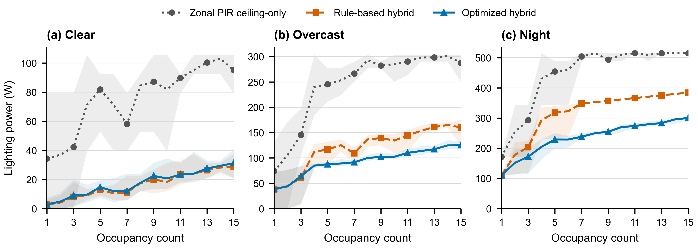
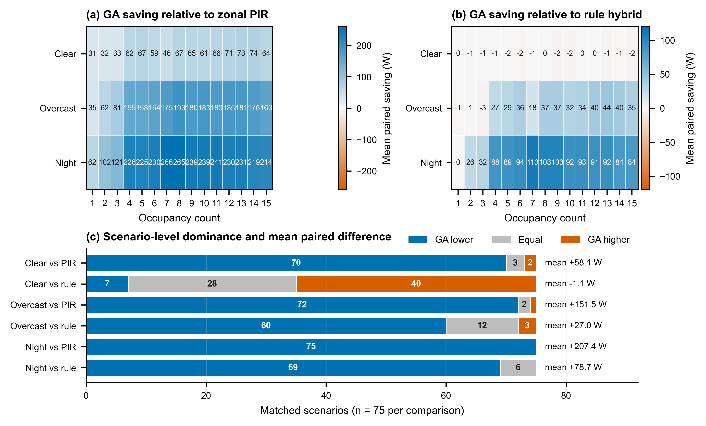
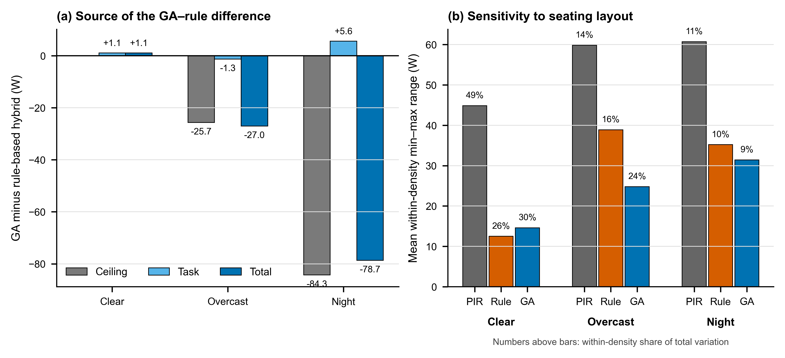

# ASIM 2026 照明控制实验结果分析报告

## 从初步现象到多因素交互结论

### 核心结论

在 225 个按天空条件、占用人数和座位布局严格配对的模拟场景中，混合顶灯—桌面灯控制相较纯顶灯分区 PIR 显著降低了照明功率。遗传算法（GA）的额外价值并非恒定：Clear 条件下，预设规则混合控制已经接近功率下限，GA 平均多耗 1.10 W；Overcast 和 Night 条件下，GA 分别进一步降低 27.02 W 和 78.68 W。其主要机制不是简单减少所有灯具功率，而是更有效地压低背景顶灯，并将有限功率定向分配给被占用工位。因此，本实验最有意义的结论不是“GA 永远最好”，而是：**优化价值由日光可用性、占用密度、座位空间分布和控制架构共同决定。**

## 1 分析基础：先保证比较公平

数据覆盖 Clear、Overcast、Night 三种天空条件；每种条件包含 1–15 人、每个人数五种座位布局，共 75 个场景，合计 225 个场景。所有策略均在相同天气、相同人数、相同座位组合下配对比较。报告指标为瞬时照明功率（W），不是能耗（Wh 或 kWh）。五种布局属于预设设计样本，并非从总体随机抽取的独立重复，因此本文报告均值、差值、范围和完整胜负次数，不作显著性检验。

| 天空条件 | 分区 PIR 纯顶灯 (W) | 规则混合 (W) | GA 混合 (W) | GA 相对 PIR | GA 相对规则混合 |
|---|---:|---:|---:|---:|---:|
| Clear | 75.50 | 16.34 | 17.44 | 节省 58.06 W（76.9%） | 多用 1.10 W（6.7%） |
| Overcast | 244.46 | 120.03 | 93.01 | 节省 151.45 W（62.0%） | 节省 27.02 W（22.5%） |
| Night | 443.52 | 314.78 | 236.10 | 节省 207.42 W（46.8%） | 节省 78.68 W（25.0%） |

## 2 初步结论：天空条件决定负荷水平，人数只解释部分变化

**图1｜功率—人数关系。** 折线为同一人数下五种座位布局的均值，阴影为最小值至最大值，不是置信区间。

三个直接现象十分清楚。第一，日光越弱，三种控制方式的功率均越高，天空条件构成照明需求的首要边界。第二，功率总体随人数增加，但并不严格单调，尤其是分区 PIR：同样人数落在不同控制区，会触发完全不同的顶灯档位。第三，两种混合控制在三种天空条件下均大幅低于纯顶灯 PIR；但 Clear 条件中规则混合与 GA 曲线几乎重合，说明“引入桌面灯”带来的架构收益远大于继续优化带来的收益。

图中的阴影还揭示了一个容易被人数均值掩盖的信息：**人数相同不代表照明需求相同。** 座位靠窗、靠内区或跨越多个控制区，会改变顶灯触发范围和可利用日光，因此综合平均只能作为第一层描述，不能单独支持策略优劣判断。

## 3 条件化结论：GA 的优势随天空条件和密度发生转折

**图2｜严格配对后的策略证据。** (a,b) 每格为同一天空条件和人数下五种布局的平均配对节省，正值表示 GA 功率更低；(c) 汇总每种比较的 75 个完整场景。

相对分区 PIR，GA 在 225 个场景中有 217 个功率更低、5 个相同、3 个更高，说明混合优化总体上稳定优于纯顶灯分区控制。相对更强的规则混合基线，结论则具有清晰条件性：

- **Clear：** GA 仅在 7/75 个场景更低，28 个相同，40 个更高；平均多用 1.10 W。任何占用人数下都没有形成正的平均节省。
- **Overcast：** GA 在 60/75 个场景更低；从 4–15 人的 60 个场景看，59 个更低、1 个相同、0 个更高，优势由偶然结果升级为跨布局的一致模式。
- **Night：** 1 人时五种布局全部持平；2–15 人中，GA 有 69 个更低、1 个相同、0 个更高，是最稳定的增益区间。

因此，不能把所有密度混合后只给一个总平均。更准确的论文表述是：**GA 对规则混合控制的增益在日光不足且存在多工位协调需求时出现；日光充足时，简单规则已足够。**

## 4 机理结论：优势来自重新分配，而非等比例调暗

**图3｜优化机理与空间敏感性。** (a) 为 GA 减去规则混合控制，负值表示 GA 用电更少；(b) 为同一天气和人数下五种布局的平均极差，柱顶百分数为布局内变化占总变化的比例。

从规则混合升级到 GA 后，三种天空条件呈现不同机制：

| 天空条件 | 顶灯变化 | 桌面灯变化 | 总功率变化 | 机理解释 |
|---|---:|---:|---:|---|
| Clear | 0.00 W | +1.10 W | +1.10 W | 顶灯已关闭，优化空间很小；额外桌面灯档位使 GA 略高 |
| Overcast | −25.70 W | −1.32 W | −27.02 W | 主要通过降低背景顶灯，同时轻微降低桌面灯 |
| Night | −84.30 W | +5.62 W | −78.68 W | 用少量定向桌面光替代大量背景顶灯，形成最大净节省 |

这说明 GA 的核心作用是协调两级照明资源。Night 条件最能体现这一点：桌面灯平均增加 5.62 W，却换来顶灯减少 84.30 W，净降 78.68 W。若只报告总功率，会错过“局部补光替代全局照明”这一最重要的机制发现。

## 5 高维结论：四个因素共同决定最优策略

把天气、人数、布局和控制方式同时考虑后，可以得到比总体均值更具解释力的四层规律：

1. **天空条件定义可优化空间。** Clear 时日光已承担主要照明；Overcast 和 Night 时人工照明成为主要可控负荷。
2. **占用密度决定协调复杂度。** 相对规则混合，Overcast 的优势从 4 人开始稳定；Night 在 2 人后几乎全面出现。中密度 Night 的平均节省最大，为 100.24 W（28.8%）。
3. **座位布局决定同密度下的实际需求。** 同人数场景仍有明显功率范围。Clear 条件中，布局内变化占总变化的 26.0%–48.8%，说明有日光时“坐在哪里”比“有几个人”更关键。
4. **控制架构决定能否利用空间差异。** PIR 只能按区开启顶灯；规则混合先获得大部分架构收益；GA 在弱日光和多人分布下进一步协调顶灯与桌面灯。

| 条件 | 主要收益来源 | GA 相对规则混合的适用判断 | 论文中的结论强度 |
|---|---|---|---|
| Clear | 从纯顶灯转向混合照明 | 无额外节能优势，规则控制更简洁 | 近似等效，不宣称 GA 优越 |
| Overcast | 混合架构 + 档位协调 | 4 人以上跨布局稳定受益 | 条件性优势明确 |
| Night | 以局部任务光替代背景顶灯 | 2 人以上几乎全面受益 | 最强且最稳定的优势 |

由此得到的高维控制逻辑不是为全工况选定一个固定赢家，而是形成**分情境策略**：日光充足时采用规则混合控制；日光不足、人数增加或座位跨区分散时启用 GA 优化。若未来部署需要压缩计算成本，这一规律还可转化为以天空条件和占用状态为门控变量的分层控制器。

## 6 论文级最终结论

本研究表明，混合环境照明与任务照明相较分区 PIR 纯顶灯控制，在三种天空条件下均显著降低了照明功率。然而，遗传算法的附加收益具有明确情境依赖性：Clear 条件下，规则混合控制已达到近似最低功率；Overcast 和 Night 条件下，GA 通过减少背景顶灯并将光输出定向分配至占用工位，分别取得 22.5% 和 25.0% 的进一步平均节省。座位布局在同一人数下仍造成显著功率差异，表明占用人数不足以完整描述照明需求。因而，本研究的核心贡献是揭示了日光可用性、占用密度、空间分布与控制架构之间的耦合关系，并据此界定优化控制真正有价值的运行区间。

## 7 结论边界与下一步核查

- 当前表格未包含每个最终解的照度与均匀度输出，因此功率比较已验证，但尚不能从这些表格独立证明所有策略满足完全相同的视觉约束。
- 三个 GA 高于零功率 PIR 的异常场景应回查：Clear 两人（座位 13、18）、Clear 三人（13、17、22）和 Overcast 一人（23）。这可能意味着零功率基线并不满足视觉要求，也可能反映 GA 收敛问题。
- 正式论文宜补充重复优化或收敛检查，并将“全局最优”收敛为“在给定搜索设置下获得的优化解”。

**一句话结论：** 混合照明决定了主要节能幅度，GA 决定了弱日光、多工位和空间分散条件下还能进一步节省多少。
